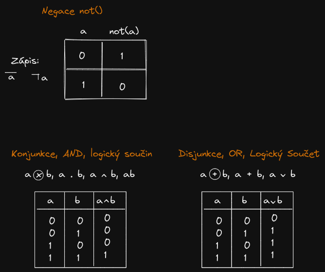

# Booleova Algebra
- 0, False, L
- 1, True, H

- Logická funkce složena z logických operací
- Základní logické operace

## Základní pravidla
- Zákon komutativní: a + b = b + a ... a\*b = b\*a
- Zákon asociativní: (a + b) + c = a + (b + c)
- Zákon involuce: 

- Zákon doplňku: 

- Zákon idempotentní: 
