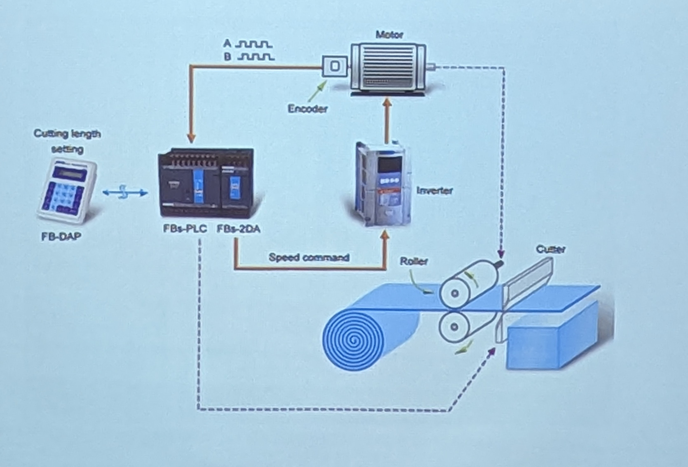
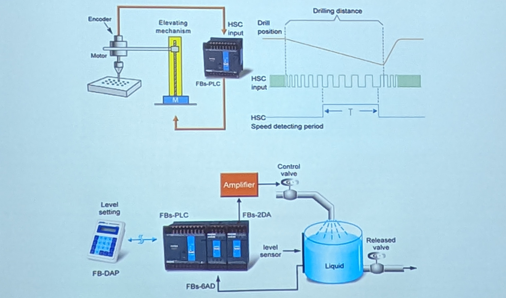
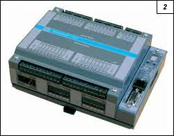

# PLC Systémy
- Programovatelný logický automat
- automatické ovládání aplikací a zařízení
- malé a levné jednotky v podobě elektronických krabiček

- Dlouhodobě patří k základům automatického měření a regulace rianých aplikaci a procesů
- Jednoduche modulárni a lehce programovatelné jednotky
- Mnoho vstupů a výstupů pro snadné připojeni senzorů, displeú, spínačů a tlačitek, motorů a různých dalších přístrojů a zařízeni
- Možnost datové drátové i bezdrátové komunikace
- Funkce celého PLC i ovládání připojených prvků je izeno uleženým programom Primé programování i průběžná grafická simulace
 - Po připojení PLC k PC pomoci USB & RS-232 labels i reálne zkoušeni a testovani

# Použítí PLC
-  Centrální řízení jednodušších aplikaci MaR
- U velkých regulačních a řídících systémů pro distribuované decentralizované Fizení jednotlivých procesů
## Příklady použiti
- Řízení výrobních strojů, plnících a balících strojů
- Regulace chlazení a vytápění
- Řízení osvětlení
- Zabezpečovací systémy
- Vizualizace procesů - zobrazení informací, indikace
- Zpracování signálů přímo na místě měření

# Struktura PLC
- Základní řídicí jednotka (basic/CPU modul) - základní blok PLC, který obsahuje:
- Zdrojovou část - napájení jednotky, příp. dalších modulů
- Procesorovou část - tvořená CPU, FPGA
- Komunikační rozhraní - základní propojení s PC a s dalšími PLC
- Několik binárnich/logických vstupů a výstupů

- Rozšiřující moduly (expansion modules) - rozšiřují základní jednotku o další prvky:
- Další vstupy logické a analogové (napěťové/proudové)
- Další výstupy - tranzistorové, reléové a analogové výstupy, výkonové
- Různé komunikační sběrnice - RS-232/422/485, LPT, Ethernet (TCP/IP), PROFIBUS, MODBUS, GSM apod.

- Speciální moduly- např. regulátory motorů, PWM výstupy, zesilované/kompenzované vstupy pro tenzometry/termočlánky/termistory, sběrnicové opakovače apod.

# TECOMAT TC600 - Kompaktní PLC
- od 12/8 až do 20/20 binárních vstupů/výstupů na ZM
- 0/4 analogové vstupy a 0/4/8 analogových výstupů na ZM
- s rozšiřovacími moduly max 48/40 nebo 56/32 binárních a 20/8 analogových vstupů/výstupů
- čítač, pulzní snímač
- měření fáze a frekvence
* 3 sériové komunikační linky paměť' programu 32 kB RAM + záložní EEPROM
- přídavná paměť dat 0,5 MB
- zálohování RAM a RTC
