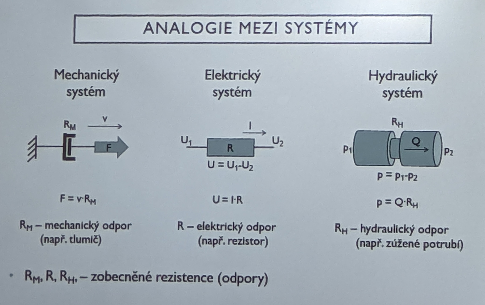
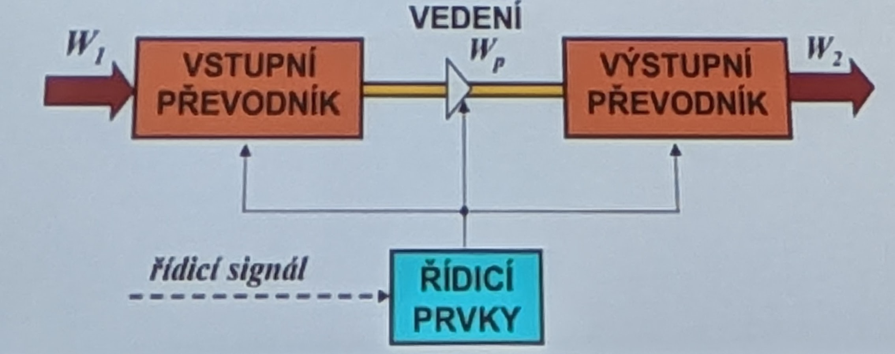

# Prostředky automatizace

- Rozdělení prostředků dle media nesoucího informaci, energii
	* **Mechanické** (sila/moment, rychlost/úhl. rychlost) - hmota
	- **Elektrické** (napětí, proud) - elektrický náboj
	- **Hydraulické** / pneumatické (tlak, průtok) - tekutina

- U komplexních systémů se setkáváme s kombinacemi těchto prostředků
- Základní veličiny popisující různé druhy systémů (různé prostředky) jsou analogické

## Výkonové veličiny
- Pro většinu systémů existuje tzv. dvojice **výkonových veličin**:
- zobecněné úsili (effort) - e
- zobecněný tok (flow)-f
- úsilí \* tok = energetický výkon - P [W] 
- Energetický výkon, běžně pouze výkon, je množství práce (energie) vykonané za jednotku času
- Jedna výkonová veličina, například tok, sama nemůže přenášet energii (výkon), může však přenášet informaci

1. Zobecněné úsilí
2. Zobecněný tok

| Systém                     | Název                    | Značka, jednotka  | Název            | Značka, jednotka |
| -------------------------- | ------------------------ | ----------------- | ---------------- | ---------------- |
| mechanický (posuvný pohyb) | síla                     | F [N]             | rychlost         | v [m/s]          |
| mechanický (rotační pohyb) | moment síly              | M [Nm]            | úhlová rychlost  | ω [rad/s]        |
| elektrický                 | elektrické napětí        | U [V]             | elektrický proud | I [A]            |
| magnetický                 | magneto-motorické napětí | Um [A] | magnetický tok   | Φ [Wb]           |
| hydraulický/pneumatický    | tlak                     | p [Pa]            | objemový průtok  | Q [m^3/s]        | 

# Analogie mezi systémy 

# Tekutinové Mechanismy
- Energie přenášená kontrolním objemem ideální tekutiny, reálné tekutiny, tekutinou je buď kapalina, nebo plyn
* Mechanismy mohou být postaveny tak, že využívají v ideálním případě: 
	* **Kinetickou energii** (charakteristická je vysoká rychlost proudění a nízký tlak (vodní, parní, plynové turbiny, odstředivá čerpadla, ventilátory, turbodmychadla ...).
	* **Polohovou energii** (zpravidla se transformuje na energii kinetickou, vodní nádrž - turbina-generátor)
	* **Tlakovou energii** (Pascalův zákon), (charakteristická je nízká rychlost proudění a vysoký tlak)
	* - Ek = 1/2mv2
	- Ep = mgh

# Vlastnosti HP Mechanismů

| Parametr          | Hydraulika (velikost) | Pneumatika (velikost) |
| ----------------- | --------------------- | --------------------- |
| tlak [Pa]         | 1.10^6 až 45.10^6     | <1.10^6               |
| průtok [dm^3/min] | 1 až 1.10^2           | až 1.10^3             |
| síla [N]          | 10 až 10^6            | 0,1 až 1.10^2         |
| moment [N.m]      | 1 až 10^6             | 0,1 až <1.10^2        |
| výkon [kW]        | 0,1 až <10^3          | 0,01 až 10            |
| rychlost [m.s^-1] | 0,01 až 0,5           | 0,1 až 5              |

# Princip
- **VSTUPNÍ PŘEVODNÍK** (hydrogenerátor, kompresor) W1 → Wp
- **VÝSTUPNÍ PŘEVODNÍK** (hydromotor, pneumotor) Wp → W2
- **ŘÍDICÍ PRVKY**, tzn. prvky pro rizeni (tlaku, průtoku a řízení směru a hrazení průtoku). Mohou být součástí vstupního, výstupního převodníku a nebo obou a nebo mohou být umístěny ve spojovacím vedení.
- **ŘÍDICI SIGNÁL**, spojitý, nebo digitálni.

