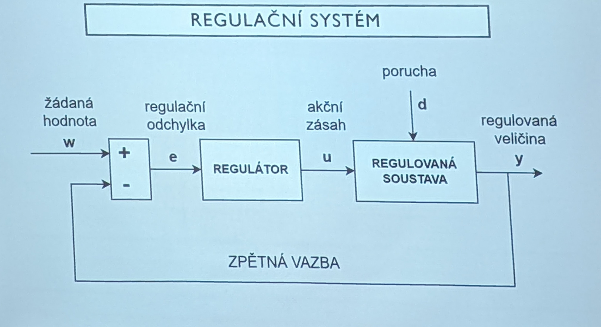

# Mechatronika
- Skládá se z více částí
- Základní: Mechanika, Elektronika, Informatika, Řízení 
# Automatizace
- Mechanizace - proces při němž stroje nahrazují člověka kde nestačí (nebo při prácí co se furt opakuje)
- **Automatizace** - lidskou řídící činnost nahrazujeme technickými zařízeními (řízení bez zásahu člověka)
## Výhody
- Produktivita, Přesnost, Snížení pracovníků, Omezení ztrátového času, Více výrobních kapacit, Zvýšení kvalifikace pracovníků
## Podmínky zavedení
- vyhovující úroveň mechanizace (spolehlivost)
- dostatečná přesnost a diagnostika
- dostupnost prostředků
- dobrá znalost výrobního procesu

## Řízení 
- Zpracovávání informací pro řízení objektu nebo procesu pro ovládání/regulaci podle parametrů
- Dělí se na ovládání:
	- Soustava co nedává zpětnou vazbu (Dveře, Světlo)
- Regulace:
	- Soustava co dává zpětnou vazbu pro další "regulaci" (Kotel, Topení)

# Regulační systém 

- Regulační systém (regulační obvod) - je zvláštní druh složeného zpětnovazebního systému, který je tvořen řídícím a řízeným systémem
- Řídící systém (regulátor) - zařízení, kterým se uskutečňuje řízení (regulace)
- Řízený systém (regulovaná soustava) - zařízení (systém), na které působí regulátor
- Regulovaná veličina (y) - veličina, jejíž hodnota je regulací udržována v předepsaných podmínkách
- Žádaná hodnota reg. veličiny (w) - předepsaná hodnota, na které má být regulovaná veličina udržována.
- Regulační odchylka (e = w- y) - rozdíl skutečné hodnoty reg. veličiny a žádané hodnoty reg. veličiny.
- Akční veličina (u= vstup řízeného systému) - zasahuje do regulačního procesu tak, aby regulační odchylka byla minimální. Je to výstupní veličina regulátoru a vstupní veličina řízeného systému.
- Poruchová veličina (d) - neúmyslná a nepředvídaná změna regulované veličiny.

# Příklad pro výpočet matic (jak to budeme dělat)

# Užití v průmyslu
- automatizační technika
- Inteligentni senzorika
- nanomateriály
- letecký průmysl
- zdravotní technika
- optoelektronika a fotonika
- hlasové technologie
- biotechnologie
