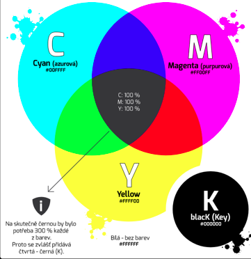

# [Grafika a formáty](https://vosassvarnsdorf.sharepoint.com/:p:/r/sites/3IT-PGR/Vukov%20materily/%C3%9Avod%20do%20po%C4%8D%C3%ADta%C4%8Dov%C3%A9%20grafiky%20-%20principy,%20rozli%C5%A1en%C3%AD,%20barevn%C3%A9%20modely.pptx?d=w891ff64006cb4f589085aa6b1050b6fb&csf=1&web=1&e=Xfovce)
## Základní rozdělení
- 2D, 3D
- Rastr, Vektor
- Grafika naspad (tisk s okrajem které se poté "odstřihnou")

## Typy obrázků
- Pérové obrázky (pouze černá bílá)
- Černobílé (stupně šedi)
- Barevné

- 72 DPI - Kvůli ušetření místa na disku a převážne pro web
- 300 DPI - Pro větší tisk, projektory, atd...

- JPEG/JFIF (JPEG File Interchange Format) - Není náročný 
- PNG (Portable Network Graphics)
- GIF (Graphics INterchange Format)
- BMP (Bit Mapped Picture)
- SVG (Scalable Vector Graphicsě)

# Barevné Modely
- Barvy jsou tvořeny (míchány) ze základních barev Míchání se zapisuje různými logickými způsoby - barevnými modely

## Míchání barev:
- Barvy jsou výsledkem vnímání lidského zraku Lidé ve skutečnosti vnímají pouze světo
- Viditelné světlo je elektromagnetické záření o vinové délce přibližně 390-790 nm
- Světlo různých vinových délek vnímáme jako různé barvy
- Bílé denní světlo vnímáme jako směs různých vinových délek, chybí nějaká položka pak takové světlo vidíme jako barvu

# Model RGB
- Jednotlivé složky barev se sčítají 
- Pracuje se třemi základními barvami: červenou, zelenou a modrou (RGB):
	- smícháním všech barev vznikne barva bílá
- Tento způsob používají například monitory a displeje

# Model CMYK
- S každou přidanou barvou se ubírá část původního světla
- Základní barvy jsou: azurová, purpurová a žlutá; smícháním všech těchto barev vznikne černá
- Použití u tiskáren: např. různé druhy tiskových technik: ofset, digitální, tisk...
- využívají odraz světla

# Barevný Prosto (GAMUT)
- Gamut je dosažitelná oblast barev v určitém barevném prostoru
- Barvy mimo tuto oblast lze v daném barevném prostoru zobrazit jen přibližně
- Barevný gamut CMYKU je menší, než RGB
- To v praxi znamená, že ne všechny barvy je možné zobrazit na monitoru (RGB) a vytisknout (CMYK)
- Proto grafiku, konečně realizovanou tiskem, stavíme od začátku v režimu CMYK: vyhnutí se nežádoucímu barevnému překvapeni" při tisku

