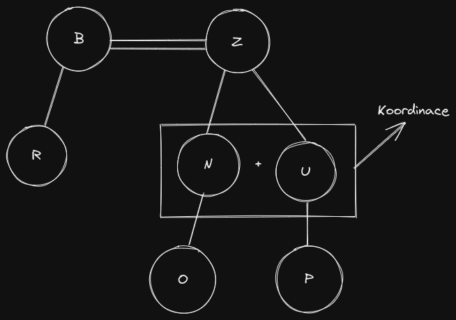
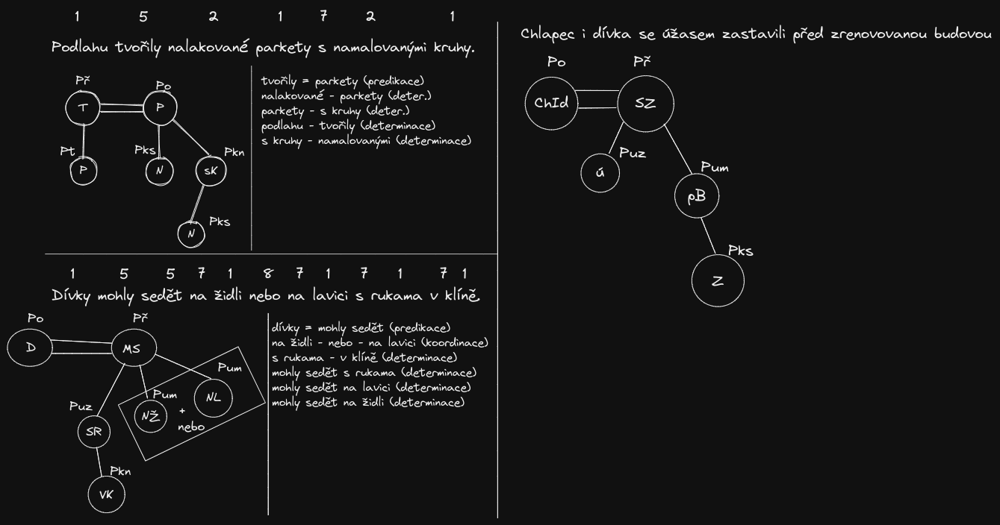

# Významové vztahy ve větě
```
Rozvodněná bystřina, říčka Loupnice, včera zaplavila opuštěnou náves i přilehlé ulice.

bystřina = zaplavila (predikace)
opuštěnou  - náves (determinace)
přilehlé - ulice (determinace)
rozvodněná - bystřina (determinace)
včera - zaplavila (determinace)
náves i ulice (koordinace)
říčka Loupnice (apozice)
bystřina - říčka (apozice)


Na stěně obrazárny visel kubistický obraz Jozefa Čapka.

kubistický obraz = visel (predikace)
Jozefa Čapka (apozice)
Na stěně - obrazárny (determinace)
obraz - Jozefa Čapka (determinace)

```


# Přisuzování (predikace)
- vztah mezi podmětem a přísudkem
- přísudek říká něco o podmětu
- jaká je vlastnost podmětu, co dělá, v jakém stavu se nachází
- vyjádření tvarovou shodou v osobě a čísle obou větných členů
- vyskytuje se pouze u vět dvoučlenných (ve větách, kde je podmět i přísudek)

# Určování (determinace)
- funkce zpřesňování jednoho slova jiným slovem
- vztah mezi řídícím větným členem a rozvíjejícím větným členem
- vztah mezi řídící větou a větou závislou (*vedlejší*)
- rozvíjející větný člen blíže určuje vlastnosti nebo okolnosti členu řídícímu (hnědý kabát, velmi vysoký strom, nepřišel pro vážnou příčinu, seděli před chatou...)

# Přiřaďování (koordinace)
- vztah mezi navzájem nezávislými celky
- platnost týchž větných členů (bratři i sestry)
- každý člen označuje jinou skutečnost

# Apozice 
- podobná koordinaci
- větné členy vyjadřují stejnou skutečnost (Vítězslav Nezval = významný představitel poetismu, pohoří Ural = geografická hranice mezi Evropou a Asií, sedmikráska neboli chudobka)